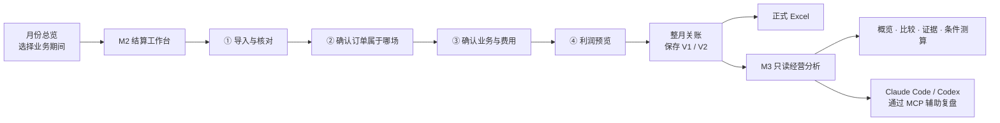
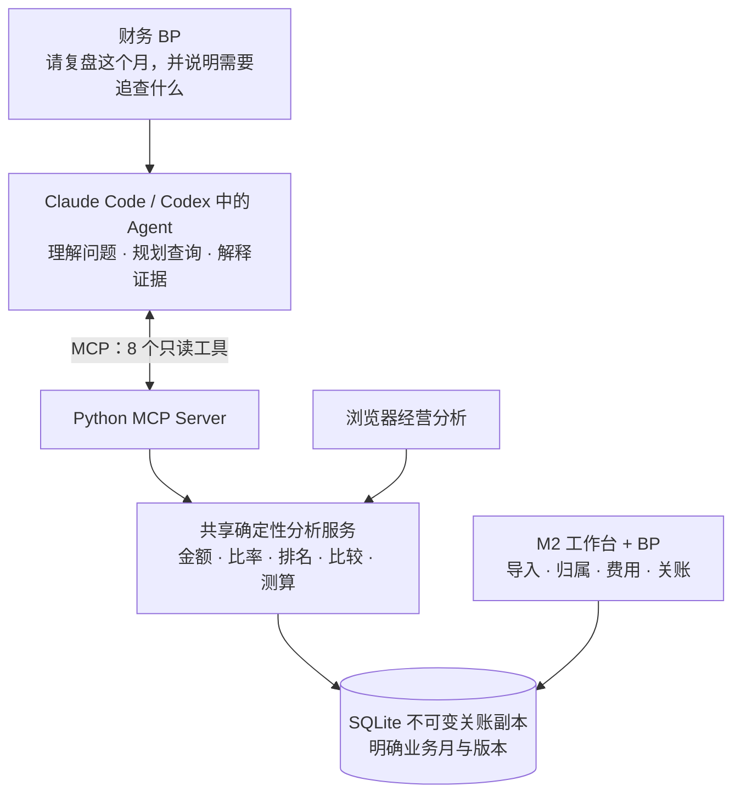

<div align="center">

# 直播经营复盘工作台

**这一场卖了多少，离真正赚到多少，还有几步？**

面向财务 BP 的直播电商利润核算与 AI 辅助复盘原型。<br/>
把订单、商品成本、达人佣金、投流和月度共享费用，连接成一份有依据、能追溯、可复核的经营结果。

[下载桌面开发验证版](https://github.com/LAN1357/lan/releases) · [开始体验](#快速开始) · [操作手册](docs/workbench-quickstart.md) · [AI 与 MCP](#ai-和-mcp-各自做什么)

**Python 3.11+ · SQLite · Excel · macOS 桌面 / 本地浏览器 · 8 个只读 MCP 工具**

</div>

---

## 从一场直播结束说起

直播结束，运营看到了成交额和投产比。财务 BP 还要继续追问：

- 退款发生后，收入是否已经冲回？商品退回后能否重新入库？
- 达人佣金拿到的是最终结算金额，还是按支付 GMV 估出来的数？
- 一笔跨越两场直播的投流费用，究竟由谁承担？
- 人工、仓储要到月底才能确认，今天能不能先看这场的经营表现？
- 月底修改了分摊，旧报表为什么变了，能不能把原因查回来？

这个项目把这些问题落实为一条可操作的流程：**先核对来源和归属，再确认费用与口径，最后形成版本明确的结果，并让 AI 帮助组织复盘。**

它适合直播电商的财务 BP、经营分析与运营协作场景，也适合演示“财务规则如何转化为可验证的软件产品”。当前是本地单用户产品原型，已完成合成账例和自动化测试，尚未完成真实平台数据的完整业务验收。

## 一条流程，三个工作空间



| 工作空间 | 你要完成的事 | 产品如何帮助你 |
|---|---|---|
| **月份总览** | 找到需要处理的月份 | 未关账月份继续结算；已关账月份进入分析或查看历史 |
| **M2 结算工作台** | 把数据变成可信的利润结果 | 导入预览、人工确认、费用维护、范围保留、关账与正式报表 |
| **M3 经营分析** | 把核算结果变成有依据的讨论 | 查询场次与达人表现、下钻证据、比较期间或版本、执行明确假设的测算 |

桌面版和浏览器版复用同一个工作台；浏览器分析与 MCP 也共用同一套确定性分析核心。

## 四步把账算清楚

### ① 数据导入：分清“新的一场”和“原来的补充”

入口明确区分 **新增直播场次** 与 **补充或更正已有场次**。新增模式生成内部场次编号并保留来源编号映射；补充模式识别新增、更新、未变和冲突记录，先看差异再确认入账。

每次导入保留批次成员。第二天再处理数据时，可以只看本次新增和更新，不必重新面对整月已经完成的订单。

### ② 确认订单属于哪场：让收入和成本落到同一场

单场文件可以批量确认；多场混合文件可以按直播时间生成候选，之后由 BP 核对。边界时间、覆盖空档、重叠场次等异常保留给人工判断。

候选是建议，最终归属是业务决定。原始依据发生变化时，系统保留旧决定并要求复核，不会悄悄改绑订单。

### ③ 业务与费用确认：每一笔费用都有去处

- **确认是否发生**：达人、投流、坑位费、赠品分别明确适用性。
- **多 SKU 成本**：从当前订单范围自动列出 SKU，一次填多个单位成本；默认只补已有履约记录中的空缺单价。
- **核对实际费用**：佣金、物流、运费险、赠品、损耗等保留明细和确认依据。
- **处理共享费用**：投流与月度费用按明确受益范围分配，每笔分配合计必须等于来源金额；有有效参考时可以复用已确认的权重方案。

“未取得”“实际零元”“不适用”分别保存。留空不会被解释成免费，退款也不会让已经发生的物流和赠品成本自动消失。

### ④ 利润预览与关账：日常复盘和月末确认各有口径

**月中先看经营复盘利润。** 月度费用可以留空或后补；所选场次的直接收入和成本齐备，就能查看该场结果，不被其他已明确归属场次的缺失成本阻断。

**月末再确认最终结算利润。** 核对整月费用清单、月度共享费用与损益税费后关账，生成固定版本和正式 Excel。需要修改时先整月重开，再生成新版本，旧版继续保留。

> 范围会跟着你走：切换步骤、筛选、分页和维护费用，保留当前场次或导入批次。共享费用和正式关账明确标为整月范围。批次利润预览会展开为相关场次的完整数据，不会只拿新导入的几行计算利润。

预览仍要求最终结算销售额、适用的最终佣金、商品履约成本及投流等直接数据齐备。**它支持场次粒度处理，不保证每场直播刚结束就能立即得到完整利润。** 未结算或归属不明时，系统会列出待核对事项。

## 两套利润，回答两个经营问题

| 口径 | 回答的问题 | 使用时点 |
|---|---|---|
| **经营复盘利润** | 这场直播的收入，能否覆盖直接发生的经营成本？ | 直接数据齐备后，可先做场次预览 |
| **最终结算利润** | 加上本场应承担的月度费用及调整后，最终剩下多少？ | 整月清单确认并关账后 |

$$
\text{净经营收入}=\text{确认结算销售额}-\text{平台费}-\text{其他未扣款}
$$

$$
\text{经营复盘利润}=\text{净经营收入}-\text{直接成本合计}
$$

$$
\text{最终结算利润}=\text{经营复盘利润}-\text{间接费用及税费合计}+\text{其他结算调整}
$$

直接成本包括最终佣金、坑位费、达人调整、投流、商品销售成本、赠品、运费险、物流和退货损耗。间接费用及税费包括直播承担的仓储、人工、管理和已确认损益税费。

几个容易影响判断的细节：

- **避免重复扣退款**：确认结算销售额已反映的退款与取消，不再扣第二次。支付 GMV 等原始信息可留作核对，不能替代最终结算收入。
- **退款不等于商品成本全部冲回**：部分退款未退货仍保留商品成本；恢复库存与损坏退回分别处理，损坏另列损耗。
- **佣金遵循实际结算证据**：当前采用最终佣金及达人调整金额，不根据一个统一佣金率猜测所有场次。
- **分摊精确到分**：金额以整数分存储与汇总，单位成本使用 Decimal，明确舍入规则并处理分配尾差。
- **分母非正时不硬算比率**：利润率和结算销售额/投流费等指标有明确分母规则。

这里的双利润是项目定义的管理核算口径；税费由 BP 提供已确认损益金额，产品不计算应纳税额。完整指标说明见 [M3 使用说明](docs/m3-readonly-analysis.md)。

## 一份可以自己复核的合成账例

仓库自带[空白模板](docs/templates/经营复盘标准模板.xlsx)和[两场合成账例](docs/templates/经营复盘合成两场账例.xlsx)，不包含真实业务数据。按[演练步骤](docs/workbench-quickstart.md#两场合成账例演练)确认归属、适用性和指定分配后，可核对：

| 场次 | 净经营收入 | 经营复盘利润 | 最终结算利润 |
|---|---:|---:|---:|
| S1 · 合成达人场 | ¥8,700.00 | ¥1,820.00 | ¥1,120.00 |
| S2 · 合成自播场 | ¥2,900.00 | ¥1,880.00 | ¥1,880.00 |
| 合计 | ¥11,600.00 | ¥3,700.00 | ¥3,000.00 |

这些金额来自项目确定性核算流程，不是模型生成的示意数字。演练中特意指定共享费用由 S1 承担，用来验证规则与追溯，并不表示这是实际经营中的推荐分摊方案。新增模式下，页面会显示生成的内部场次编号；S1/S2 是合成文件里的来源编号。

可以再做一个小实验：保留 S1 的完整资料，让 S2 暂缺 SKU 成本。选择 S1 时仍可预览经营利润；切换整月完整核对时，S2 的缺失项会继续阻止关账。局部结果与全月结果有明确区别。

## AI 和 MCP 各自做什么

**MCP 是 AI 调用产品工具的连接协议。** 在这个项目里，可以把它理解为“让 Claude Code / Codex 按约定查询已关账数据的工具接口”。



| 分工 | 当前实现 |
|---|---|
| **Agent / 大模型** | 理解自然语言中的月份、场次、指标、版本与分析意图；组织查询、解释证据、提出待验证假设和经营建议 |
| **MCP** | 把工具说明提供给客户端，将结构化参数交给分析服务，并返回结果 |
| **Python 确定性工具** | 完成金额、比率、差额、排序、规则判断和条件测算 |
| **BP 与工作台** | 确认来源、归属、成本与费用，执行正式关账和重开 |

**当前 M2 不接入大模型。** Excel 字段解析、格式校验和时间候选由程序规则完成。Agent 对提问中的业务字段和参数的理解，不等于 M2 已实现任意平台表格的 LLM 自动解析。

### 可以怎样问它

> “复盘 2026 年 9 月，先确认有效关账版本。找出需要关注的场次，分别列经营复盘利润和最终结算利润，追查关键费用依据，把事实、解释、待验证假设和建议分开。”

> “比较这个月 V1 与 V2：哪些修改改变了场次利润？总额变化和分配变化分别是什么？”

> “以指定关账版本为基准，在 S1 坑位费增减不超过 200 元内比较三个方案，其他条件保持不变。标明假设，不能改动正式数据。”

Agent 可以在明确范围内连续查证和组织分析。科目变化能说明金额如何改变，不能单独证明经营因果。条件测算是非持久化假设结果，不能自动变成正式成本或经营决定。

<details>
<summary><strong>展开查看 8 个只读 MCP 工具</strong></summary>

| 工具 | 用途 |
|---|---|
| `workbench_list_close_versions` | 确认关账目录、有效版本与历史版本 |
| `workbench_query_performance` | 按明确范围汇总、排序和查看表现 |
| `workbench_compare_performance` | 比较两个期间或范围及利润科目变化 |
| `workbench_get_session_evidence` | 下钻场次利润、SKU、分配和人工修改依据 |
| `workbench_compare_close_versions` | 比较同月两个关账版本 |
| `workbench_get_metric_rules` | 查询指标公式、分母、来源和可比性 |
| `workbench_diagnose_performance` | 按固定事实规则定位需要核查的问题 |
| `workbench_simulate_scenario` | 按明确假设测算费用或 SKU 成本变化 |

</details>

账本存储在本地；M2 和浏览器看板不需要调用模型。**使用外部 AI 客户端时，工具返回的分析数据可能被该客户端发送给其模型服务**，请按自己的数据权限和客户端设置使用。只读 MCP 不提供导入、改数、关账、任意 SQL 或任意文件路径工具。

## 快速开始

### 方式一：下载 macOS 桌面开发验证版

到 [Releases](https://github.com/LAN1357/lan/releases) 下载 `LiveCommerceWorkbench-v0.1.0-build5-macos-arm64.zip`，解压后打开应用。首次使用选择自己的账本，或创建新账本。

- 当前包面向 **Apple Silicon / macOS 13+**，已在开发机验证。
- 采用本机临时签名，尚未完成 Apple 开发者签名、公证及干净机器验收；不保证其他 Mac 可直接运行。遇到系统拦截时，可使用下面的源码浏览器方式。
- 应用包不含账本、私人配置或真实订单。MCP 需要另行在客户端配置，桌面包不自带 AI 模型或模型服务。

详见[桌面版使用说明](docs/desktop-quickstart.md)。

### 方式二：从源码启动本地浏览器工作台

```bash
git clone https://github.com/LAN1357/lan.git
cd lan
python3 -m venv .venv
source .venv/bin/activate
python -m pip install -e '.[dev]'
python -m src.workbench.app
```

打开 **http://127.0.0.1:8765**。默认使用项目下的 `data/workbench.db`；首次启动会创建新库。服务仅监听本机，同一账本一次只允许一个工作台进程打开。

首次体验建议明确使用独立试用库：

```bash
python -m src.workbench.app --db data/trial.db
```

在界面选择 **2026-09**，导入合成账例并按手册演练。不要把演示文件导入正式业务账本。需要重新生成空白模板和合成文件时，运行：

```bash
python -m src.workbench.demo
```

### 连接 Claude Code / Codex

先在工作台关账，再按[MCP 接入指南](docs/m3-readonly-analysis.md#codex-与-claude-code-接入)注册 `livecommerce-m3-readonly`。使用项目虚拟环境中的 Python，且 `--db` 必须指向工作台实际使用的同一个账本。

分析页面提供 **“使用 Claude Code / Codex 分析本月”** 入口，可以复制带月份、版本和场次范围的分析指令，在客户端粘贴后继续提问。

`claude mcp get livecommerce-m3-readonly` 与 `codex mcp get livecommerce-m3-readonly` 用于检查已配置连接；它们不是启动命令。配置完成后，stdio 服务由客户端按需启动。

## 需要准备哪些数据

| 标准工作表 | 内容 | 是否可后补 |
|---|---|---|
| 场次 | 来源编号、达人或自播标识、开播和结束时间 | 核算前须明确场次 |
| 订单行 | 订单与行号、SKU、数量、支付时间、最终结算状态和金额等 | 可补充结算信息；缺失会阻断出数 |
| 商品与履约 | 单位成本、出库、恢复库存、损坏退回、赠品和物流等 | 可补齐实际成本；不能猜测数量 |
| 达人费用 | 最终佣金、坑位费、达人调整及结算依据 | 适用业务须齐备 |
| 投流 | 账号、计划、时间区间、实际消耗 | 有投流须取得并确认分配 |
| 月度费用 | 直播承担的仓储、人工、管理、损益税费和其他调整 | 可留空或省略该表；月末再补 |

目前输入契约是标准 Excel，其他五张表须保留。**抖音 / 千川任意原始导出文件直接适配尚未实现**；先按[字段说明](docs/workbench-quickstart.md#标准模板字段)整理数据，长订单号和单价建议使用文本格式。

## 技术结构与可信边界

```text
src/
├── workbench/              # M2 工作流、导入、归属、费用、范围、关账、本地 Web
├── engine/session_profit.py # Decimal / 整数分核算及守恒分摊
├── reports/management.py   # 从指定关账副本导出正式 Excel
├── analysis/               # M3 共用分析核心、HTTP 与只读 MCP
└── desktop/                # pywebview 桌面窗口、账本配置与运行生命周期
packaging/macos/            # macOS 应用构建入口
.codex/agents/              # Codex 只读经营复盘角色
.claude/agents/             # Claude Code 只读经营复盘角色
docs/                      # 操作手册、标准模板、设计与历史资料
tests/                     # 核算、工作流、分析与桌面回归测试
```

- **M1 是核算基础**：定义财务科目、单位、舍入、分摊及双利润。
- **M2 是正式操作入口**：事务写入、人工确认、依据变化复核、批量预览和月度版本。
- **M3 是关账后分析**：只读固定版本；重开或换版后重新校验引用，避免把旧结果当作当前结果。
- **正式报表可追溯**：七张 Excel 工作表覆盖管理摘要、场次损益、核对与分摊明细、人工修改、SKU与公共项目、版本与口径。

早期 CSV/ROI 原型代码仍保留用于历史研究，不能混用其旧核算口径或写入型 MCP。历史说明已移到[归档](docs/archive/legacy-readme.md)，当前入口以本 README 和三份使用手册为准。

## 验证与当前边界

最近一次本地回归：**193 项通过**，源码环境和桌面隔离环境均已验证（2026-09-08，Build 5）。覆盖金额精度、退款与商品成本、共享费用守恒、重复导入、批量修改、范围保留、局部预览、关账重开、版本证据、只读分析和条件测算。

```bash
python -m pytest -q
```

尚未完成或不在本版范围内：

- 真实平台导出的通用字段适配，以及财务 BP 脱敏真实数据验收。
- M2 内嵌聊天、LLM 自动解析原始 Excel、自动收集平台数据或 ERP 直连。
- 合同级佣金规则管理与自动 Clawback 追扣。当前可录入最终佣金及达人调整，不能宣称已自动执行退款追佣。
- 多用户权限、云端部署、企业级并发与正式财务系统集成。
- SKU 全成本利润与营销因果归因。当前 SKU 分析展示直接贡献，共享项目另列。

后续重点是原始导出适配、差异核对和真实业务验收，持续让“结果可信、操作清楚、解释有据”落到实际使用中。

## 文档与许可

[工作台手册](docs/workbench-quickstart.md) · [桌面手册](docs/desktop-quickstart.md) · [MCP 与经营分析](docs/m3-readonly-analysis.md) · [发布说明](CHANGELOG.md)

本项目按 [MIT License](LICENSE) 提供。演示数据均为合成数据；实际财务口径、费用承担范围与经营决定仍由使用者确认。
